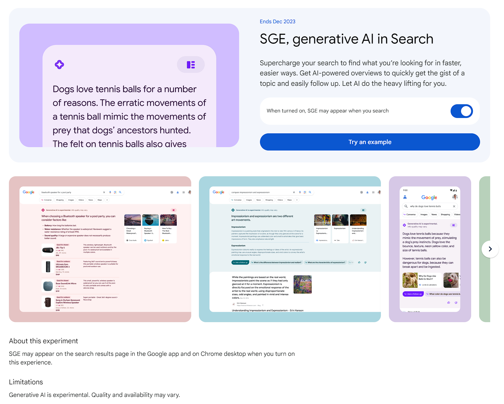
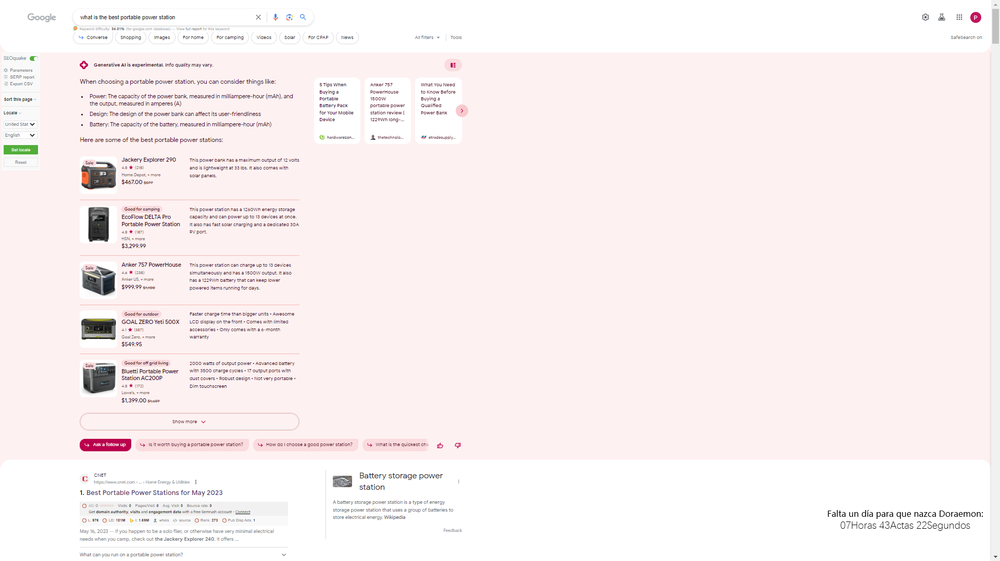
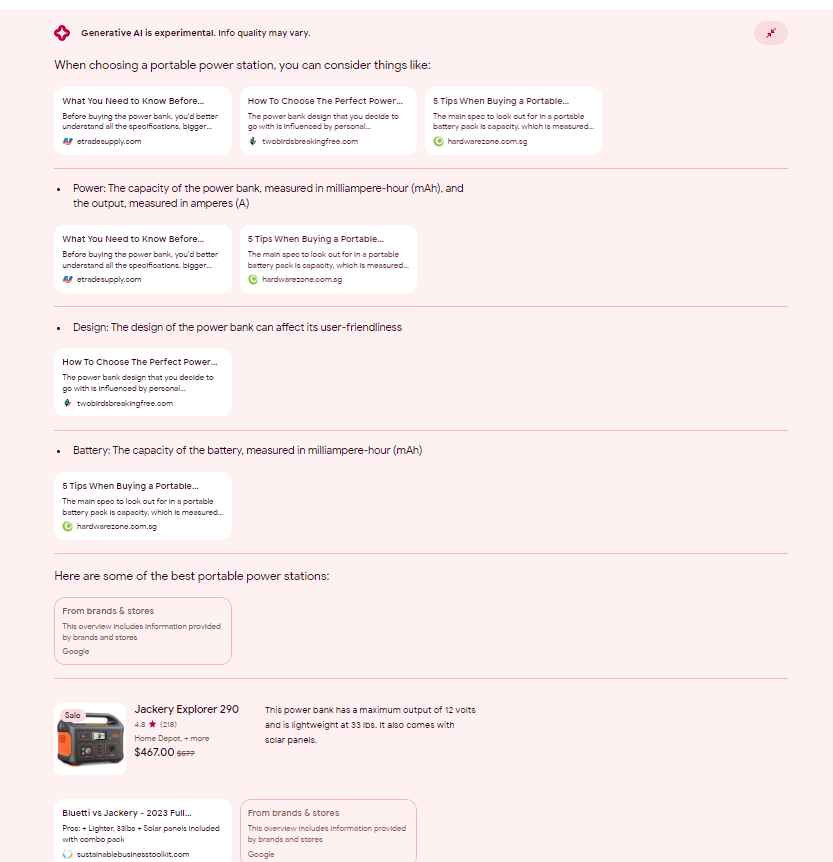
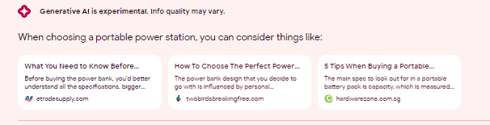
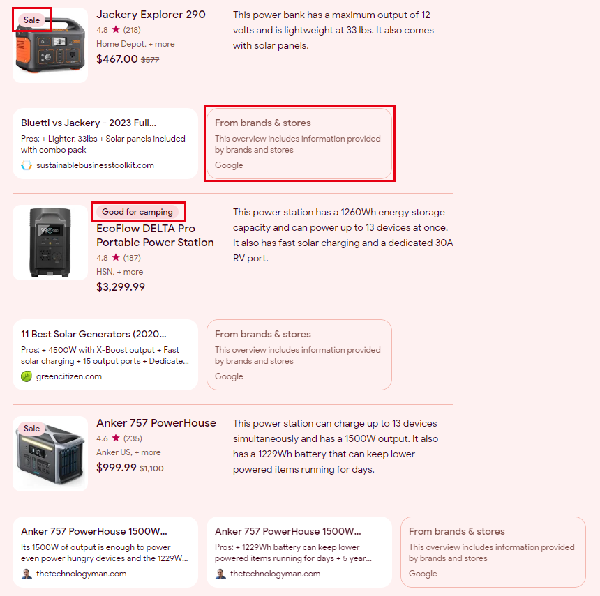
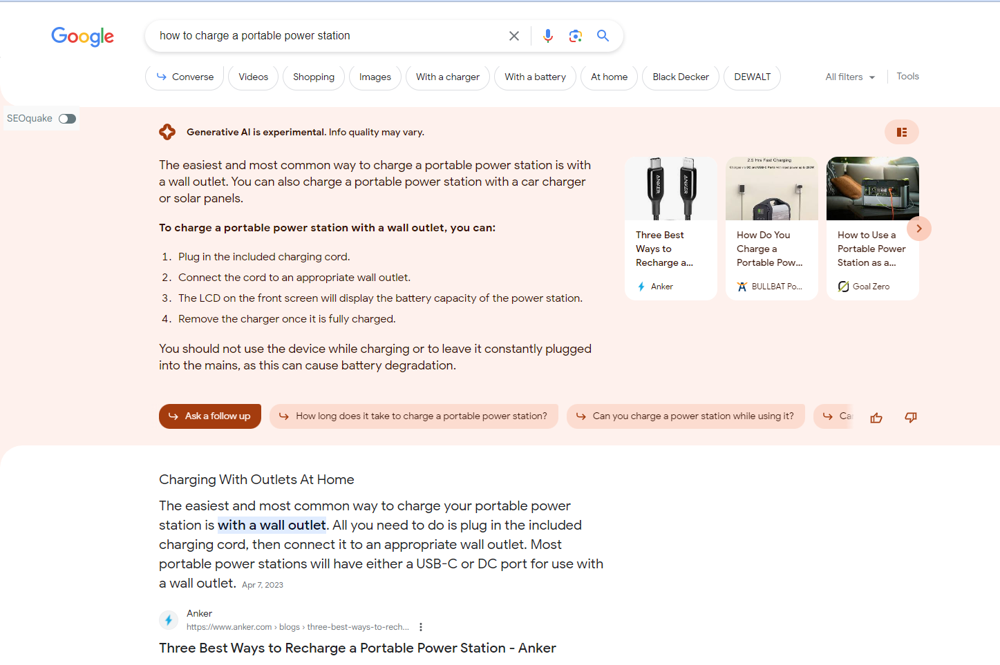
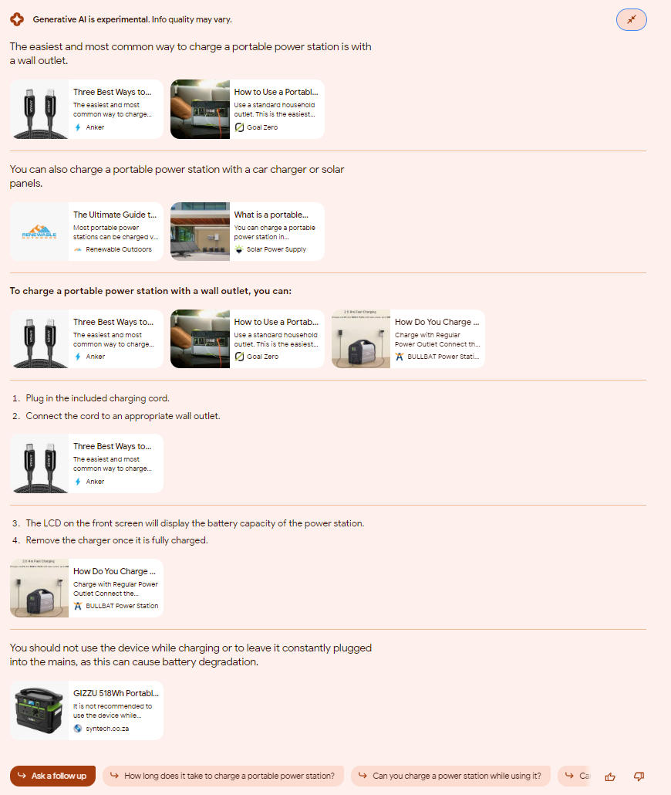
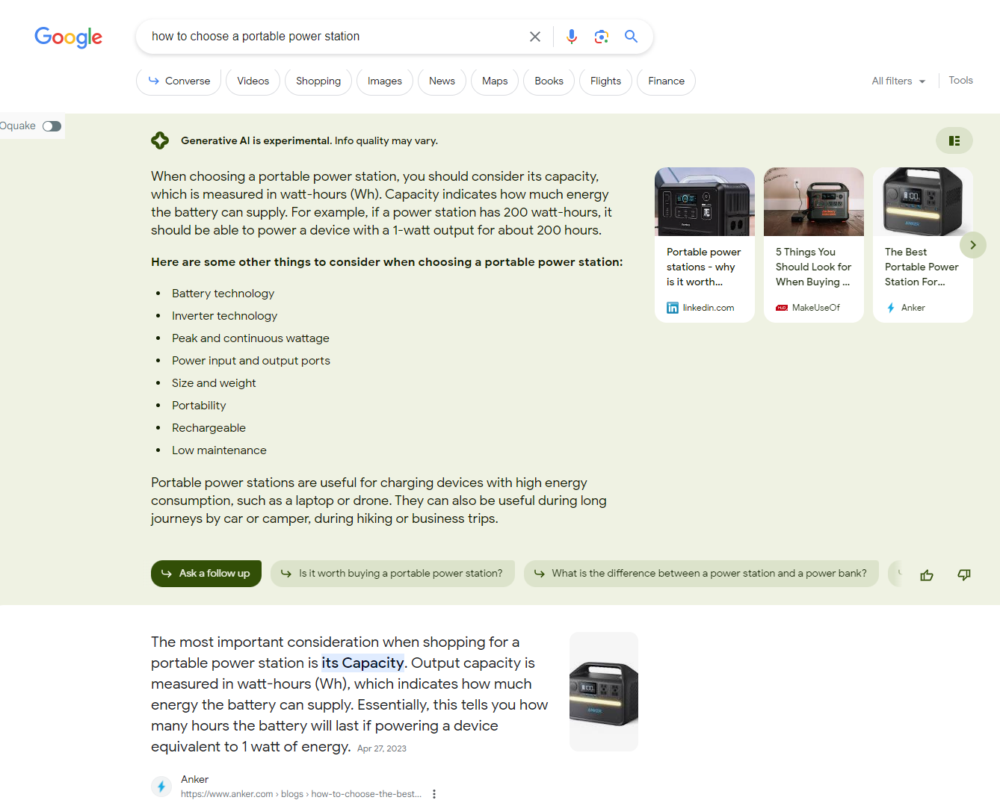
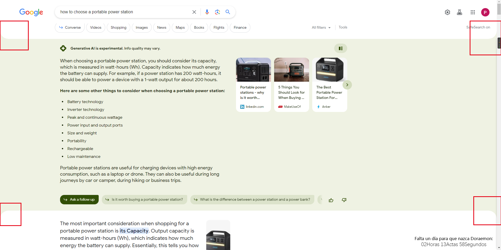
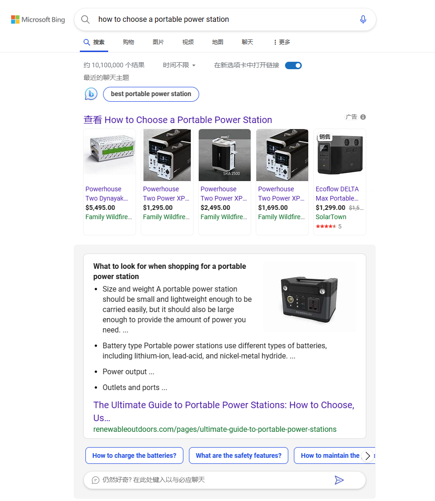

# SGE（Search Generative Experience）介绍 - Google Search Labs内测AI工具试用
\
今天收到邮件通知，Google Search Labs的申请终于通过了。

一共提供3个功能，分别是SGE-生成式搜索、Code Tips-代码提示、Add to Sheets-添加至表格。

（8月份更新了一个新功能SGE While Browsing-浏览时的生成式搜索）

这篇文章主要记录SGE的实测结果。

## SGE实测结果

### 第一个关键词"what is the best portable power station"，SERP如下：

可以看到在第一名的上方，有一段超大篇幅的AI生成式结果（类似New Bing），如果我不缩小页面，甚至不能全部截图，以下是这段内容的另一种视图：

这里有几个有意思的地方：

1、搜索结果内容对于关键词有了进一步的补充和丰富，我搜索"what is the best portable power station"，结果给出了答案（谷歌认为好的清单），以及这个答案的依据 - "when choosing a portable power station, you can consider things like:"

2、答案的依据是根据这三篇文章生成的，这三篇文章的来源暂时不得而知。

3、答案是根据不同的文章以及品牌或商店提供的信息生成的，可以看到有的商品带有"Sale"标签，有的带有"Good for something"标签

4、这些测评文章不来自下面搜索结果的任何一篇，至少前140名，谷歌为什么这么选择不得而知。

### 第二个关键词"how to charge a portable power station"，SERP如下：

1、这里我们可以将AI生成的结果和谷歌精选部分对比，很直观地发现AI生成的结果比精选更加完善且精简。

另一个视图：

1、可以看到生成这些结果的所有依据和文章来源，这次共6篇文章，3篇是排名靠前的文章，2篇是排名靠后的文章，还有1篇没有找到。这种汇聚多篇（谷歌认为的）好文章的内容，可以说明我们做SEO的方向是没错的，我们要做的就是提供优质的内容给用户，这也是谷歌致力于做的事情。

2、没有找到来源的文章，总结出的观点是"You should not use the device while charging or to leave it constantly plugged into the mains, as this can cause battery degradation."，可以看出也是对搜索结果的一种扩展和补充。

### 第三个关键词"how to choose a portable power station"，SERP如下：

结果和第二次搜索接近，答案来源于排名靠前的多篇文章，最后对于搜索结果的拓展部分，文章来源依旧找不到。

点击 Ask a follow up 部分后，会用AI搜索代替传统搜索框。

## 总结

大概总结一下：
1、SGE相较于普通的搜索，在给出一个准确的回答的基础上，还会展示给出这个答案的依据以及文章来源，此外还会将问题延申开来回答，给我的感觉是谷歌希望能在用户搜索最少次数的情况下，提供顾客最想要的内容。
2、可能是个人习惯问题，我觉得体验比Bing要好。
3、页面上这个倒角的小细节，我的思维惯性会把SGE这部分做成卡片（Bing也是如此），但谷歌将其他部分做成了卡片，SGE这部分反而成了主角，大有SGE版面会无限扩张的感觉。

